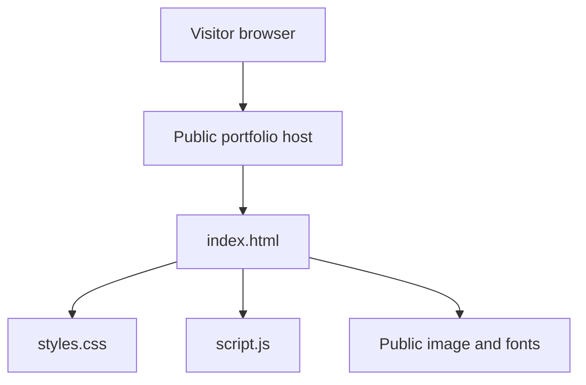

# Authentication and credential handling

## Current state

This repository is a static portfolio. It has no user accounts, login form, backend server, API routes, database connection, session store, OAuth integration, or token-processing code.

The browser requests only public files:

1. `index.html`
2. `styles.css`
3. `script.js`
4. the profile image and public Google Fonts

The JavaScript controls navigation, the current year, header styling, and scroll-reveal effects. It does not call `fetch`, `XMLHttpRequest`, cookies, `localStorage`, or `sessionStorage`.

## Request flow

No protected API is part of this flow.

## Credentials and tokens

- No credentials are collected.
- No access or refresh tokens are generated.
- No secrets are committed to this repository.
- The email and telephone links open the visitor's local mail or phone application; the site does not receive or store the message.
- GitHub connection credentials used to edit the repository are managed outside the repository and are not included in its code.

## If authentication is added later

Use a backend or managed identity provider. Store passwords only as strong salted hashes; keep API keys and signing secrets in server-side environment variables; use Secure, HttpOnly, SameSite cookies for sessions; rotate refresh tokens; validate authorization on every protected server route; and never place secrets in browser JavaScript or commit them to Git.
